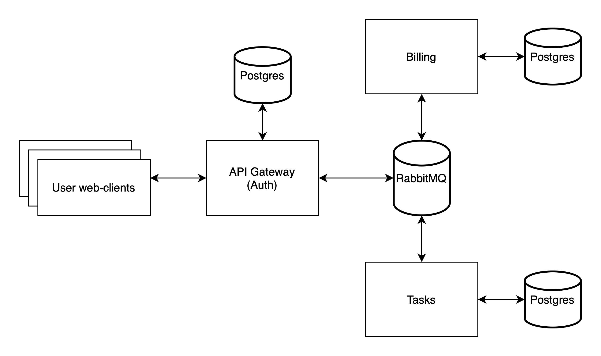
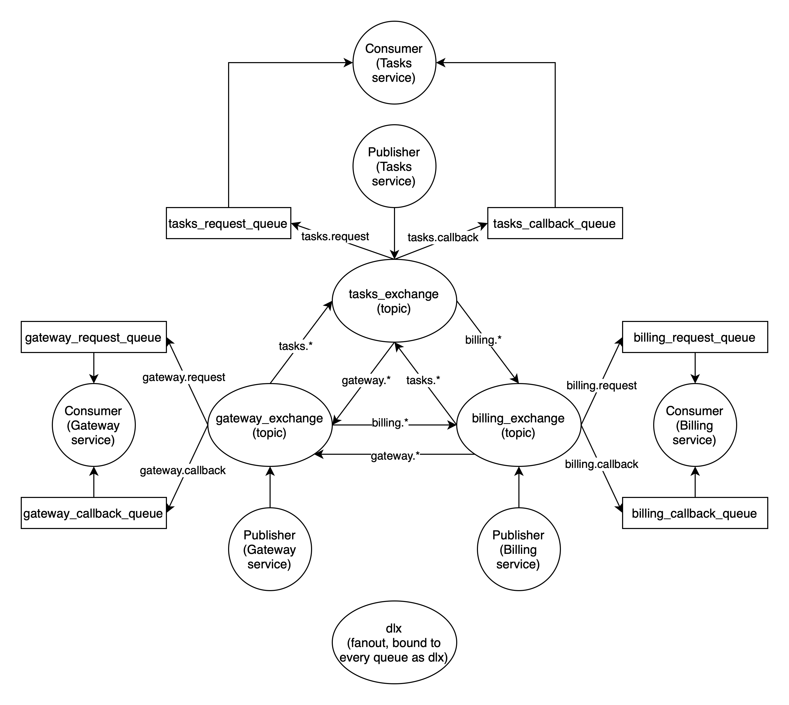

# microservices-example
Example of application with microservices async architecture.





## How to run
Docker is required in order to run this project.

When in directory root folder, execute the following commands:

`source .env`

`docker-compose up --build`

Last one will cause all services to build and run. If you want to run certain service, just execute this:

`docker-compose up SERVICE_NAME --build`

## Services documentation
`http://localhost:8001/api/docs` - Gateway API explanation

`http://localhost:8002/api/docs` - Billing API explanation

`http://localhost:8003/api/docs` - Tasks API explanation

## Autotests
In order to run autotests you should execute the following set of commands:

```
docker-compose run --rm SERVICE_NAME bash

pytest -vv --cov=app tests/
```

Right now you can run autotests only for gateway's auth part.

## Debug

Remote debugger configuration is available (uses debugpy). There is remote debugger for every service in the project. To start debugging, proceed with the following command:

`docker-compose -f docker-compose-debug.yml up`

After that you may start 1 debugger per VSCode process. 